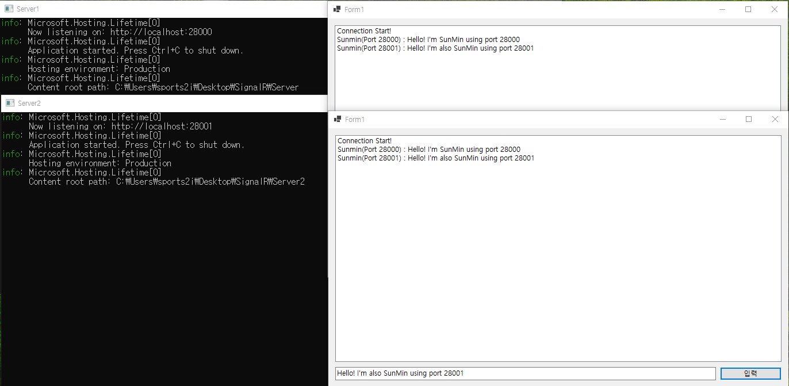

# SignalR
SignalR은 앱에 실시간 웹 기능을 추가하는 것을 간소화하는 오픈 소스 라이브러리입니다. 실시간 웹 기능을 사용하면 서버측 코드에서 클라이언트에 콘텐츠를 **즉시 푸시**할 수 있습니다.

* #### SignalR의 기능은 다음과 같습니다.
    - 연결 관리를 자동으로 처리합니다.
    - 모든 연결된 클라이언트에 메시지를 동시에 보냅니다.
    - 특정 클라이언트나 클라이언트의 그룹에 메시지를 보냅니다.
    - 늘어난 트래픽을 처리하도록 크기를 조정합니다.

* #### 전송 기술
    - SignalR은 실시간 통신 처리 방법을 서버 및 기능 내에서 가장 적합한 전송 방법으로 자동 선택합니다.
      1. WebSockets
      2. Server-Sent Events
      3. Long Polling

* #### 통신 방법
    - SignalR은 클라이언트와 서버가 서로 메서드를 호출할 수 있도록 하는 높은 수준의 파이프라인인 **허브**를 사용하여 통신합니다.
        * **허브**는 클라이언트 쪽 ```메서드의 이름``` 및 ```매개 변수```를 포함하는 메시지를 전송하여 클라이언트 쪽 코드를 호출합니다.
        * 클라이언트는 클라이언트 쪽 ```코드의 메서드 이름```과 ```메세지의 매서드 이름```을 일치시키려고 시도합니다.
        * 클라이언트에서 일치하는 항목을 찾으면 메서드를 호출하여 ```매개 변수```를 전달합니다.

* #### SignalR에 적합한 후보는 다음과 같습니다.

     * 서버에서 자주 업데이트해야 하는 앱.
    	```
    	게임, 소셜 네트워크, 투표, 경매, 지도 및 GPS 앱이 있습니다.
    	```
     * 대시보드 및 모니터링 앱.
    	```
    	회사 대시보드, 즉석 판매 업데이트 또는 여행 경고가 있습니다.
    	```
     * 공동 작업 앱.
    	```
    	화이트보드 앱 및 팀 회의 소프트웨어가 있습니다.
    	```
     * 알림이 필요한 앱.
    	```
    	소셜 네트워크, 이메일, 채팅, 게임, 여행 경고 및 다른 많은 앱에서 알림을 사용합니다.
    	```


---------------------------------------
# Redis Backplane
* #### Scale-Out
    - SignalR을 사용하는 앱은 모든 연결을 추적, 관리 해야하는데 이것은 서버 관리 측면에서 문제를 발생시킵니다.
    - 만약 서버가 하나 추가된다면 다른 서버에 있는 앱은 서버의 추가를 인식하지 못하고 해당 서버에 연결 된 클라이언트만과 통신 할 수 있습니다.
    <br>
    <p align="center" style="color:gray">
        
    </p>
    
    - 위와 같은 문제를 해결하기 위해 Redis Backplane을 사용합니다.

* #### Redis(REmote DIctionary Server)
    - Redis는 publish/subscribe 모델을 사용하는 메모리 내 key-value 저장소입니다.
    - 모든 데이터를 메모리에 저장하고 조회합니다.
    - 다양한 데이터 구조를 제공합니다.
    - 주요 Redis 사용 사례로는 캐싱, 세션 관리, pub/sub 및 순위표가 있습니다.
    - 최적화된 C 코드로 작성되었으며, 다양한 개발 언어를 지원합니다.

* #### SignalR Redis Backplane
    - SignalR Redis 백플레인은 pub/sub 기능을 사용하여 메시지를 다른 서버로 전달합니다.
    - 서버는 모든 클라이언트에 메시지를 보내려고 할 때 백플레인으로 보냅니다.
    - Backplane은 연결 된 모든 서버를 알고 있고 해당 서버를 통해 모든 클라이언트에게 메세지를 보냅니다.
<br>
    <p align="center" style="color:gray">
        
    </p>

---------------------------------------
# 구현

* ### Redis 설치
    - 설치환경
        ```
        OS: Ubuntu 20.04
        Location: WSL2(Linux용 Windows 하위 시스템)
        ```
    - 설치 명령어
        ```
        # sudo apt update
        # sudo apt install redis redis-tools
        ```
    - 환경 설정
        - Config 파일 열기
            ```
            # sudo vim /etc/redis/redis.conf
            ```
        - 외부 접근 허용을 위해 바인딩 및 암호 설정
            ```
            변경전             변경후
            bind 127.0.0.1 --> bind 0.0.0.0
            #requirepass foobared --> requirepass "원하는 암호"
            ```
        - 서비스 재시작
            ```
            # sudo service redis-server restart
            ```

* ### SignalR Server
    - 프로젝트 정보
        ```
        Platform: .NET Core 5.0
        ```
    - NuGet 패키지 설치
        ```
        패키지명: Microsoft.AspNetCore.SignalR.StackExchangeRedis
        버전: 5.0.17
        ```
    - 서비스 등록 
        ```Startup.cs```
        ```
        public void ConfigureServices(IServiceCollection services)
        {
            services.AddSignalR()
                .AddStackExchangeRedis(o =>
                {
                    o.ConnectionFactory = async writer =>
                    {
                        var config = new ConfigurationOptions
                        {
                            AbortOnConnectFail = false
                        };
                        config.EndPoints.Add({REDIS_IP}, {REDIS_PORT});
                        config.Password = {REDIS_PASSWORD};
                        var connection = await ConnectionMultiplexer.ConnectAsync(config, writer);

                        return connection;
                    };
                });
        }
        ```
        ###### 추가 옵션은 ([StackExchange 공식문서](https://stackexchange.github.io/StackExchange.Redis/Configuration.html))에서 확인 가능합니다.
    
    - 허브 생성
        ```TestHub.cs```
        ```
        public class TestHub : Hub
        {
            [HubMethodName("SendMessage")]
            public Task SendMessage(string user, string message)
            {
                return Clients.All.SendAsync("ReceiveMessage", user, message);
            }
        }
        ```
    - 허브 등록
        ```Startup.cs```
        ```
        app.UseEndpoints(endpoints =>
            {
                endpoints.MapHub<TestHub>("/testhub");
            });
        ```

* ### SignalR Client
    - 프로젝트 정보
        ```
        Platform: .NET Core 5.0
        Type: Winform Application
        ```
    - NuGet 패키지 설치
        ```
        패키지명: Microsoft.AspNetCore.SignalR.Client
        버전: 5.0.17
        ```
    - 서버와 연결 및 Message Receive 설정
        ```
        private async void Connection()
        {
            // 서버에 연결
            connection = new HubConnectionBuilder()
                .WithUrl($"http://{IP}/{HUB_NAME}}")
                .Build();

            connection.Closed += async (error) =>
            {
                await Task.Delay(new Random().Next(0, 5) * 1000);
                await connection.StartAsync();
            };

            // 메세지 받기
            connection.On<string, string>("ReceiveMessage", (user, message) =>
            {
                // list에 message 추가
                if (this.listBox1.InvokeRequired)
                {
                    this.listBox1.Invoke((MethodInvoker)delegate
                    {
                        this.listBox1.Items.Add(user + " : " + message);
                    });
                }
            });

            try
            {
                await connection.StartAsync();

            }
            catch (Exception ex)
            {
                Debug.WriteLine(ex.Message);
            }
        }
        ```
    - 서버에 메세지 보내기
        ```
        private async void button1_Click(object sender, EventArgs e)
        {
            try
            {
                await connection.InvokeAsync("SendMessage", name, textBox1.Text);
            }
            catch (Exception ex)
            {
                Debug.WriteLine(ex.Message);
            }
        }
        ```
* ### 실행
    - 주소(Port 번호)가 다른 두 서버를 켜고 클라이언트들을 각각의 서버에 연결 후 테스트
        <p align="center" style="color:gray">
            
        </p>
        정상적으로 데이터가 전송 되는 것을 확인할 수 있었습니다. 

## [샘플 코드](https://github.com/ipodsong2i/SignalR_Sample/)

##### 참조
- SignalR : https://docs.microsoft.com/ko-kr/aspnet/core/signalr
- redis 설치: https://redis.io/docs/getting-started/
